  

  
  
  

Hi, I'm **Balamurugan (Bala)**, a Senior ERPNext Consultant from India.

For 4+ years I've been building custom **Frappe / ERPNext** apps on **v15 and v16** for healthcare, manufacturing, dairy, steel, apparel, construction, retail and restaurants. I work across the whole project: requirement mapping, workflow design, custom apps, integrations and go-live.

## 🧩 What I do

| Functional | Technical |
| :--- | :--- |
| Requirement mapping and gap analysis | Custom Frappe apps and DocTypes |
| Process and approval workflow design | Controllers, hooks, server and client scripts |
| Master data setup and bulk migration | Script reports, print formats, dashboards |
| User training and go-live support | REST integrations, India Compliance, payments |

## 🧭 Featured: Frappe Pilot

A free, open-source browser toolkit for Frappe and ERPNext developers and consultants. Works on **Frappe v15 and v16**, in Chrome, Edge and Brave.

- 🩻 **X-Ray**: fieldname, type and options on every field, with custom fields highlighted
- ⚙️ **Quick Customize**: click a field and land on it in Customize Form
- 🪄 **AI Magic Filler**: fill any form with realistic test data in one shortcut
- 📦 **Data Teleport**: move records between sites, and choose what happens to ones that already exist
- 📋 Field Clipboard, 🔗 Link Peek, 🔐 Perm Inspector, 👻 Reveal Hidden, 📐 Schema Export

**[View the repo →](https://github.com/baladante94/frappe-pilot)**

## 🏭 Client work

Most of my work lives in private client repositories. A snapshot of what I've built:

| Industry | What I built | Frappe |
| :--- | :--- | :---: |
| 🏥 Healthcare | Hospital inventory and specialty clinical modules (Neurology, Pediatrics, Weight Management) on Frappe Healthcare, with bulk data imports for go-live | v15 |
| 👕 Garment manufacturing | ERPNext rollout for a uniform maker across 3 locations: buying flow with bale and lump fabric details, vendor aliases, transporter and docket tracking, with accounting kept in Tally | v16 |
| 🏗️ Steel trading | Batch-scan stock entries, warehouse-scoped deliveries, sales and stock flow | v15 |
| 🥗 Nutrition clinic | Patient management and consultation workflow for a diet-first wellness practice | v16 |
| 🏘️ Construction | Custom app and ERPNext setup for a builder (in progress) | v16 |
| 🛒 Supermarket | Purchase approvals, quick purchase, reorder reports and stall refill requests | v15 |
| 🗿 Stone craft | Enquiry to quotation to sales pipeline | v16 |

## 🛠️ Open source and side builds

| Project | What it is | Stack |
| :--- | :--- | :--- |
| [**Frappe Pilot**](https://github.com/baladante94/frappe-pilot) | Browser toolkit for Frappe and ERPNext developers | JavaScript |
| [**BookMyRoom**](https://github.com/baladante94/bookmyroom) | Hotel booking app: rooms, rate plans, meal plans, reservations and invoicing | Frappe v16 |
| [**MacDroidControl**](https://github.com/baladante94/macdroidcontrol) | Native macOS app to mirror, record and control Android devices | Swift |
| [**Ez_SuperMarket**](https://github.com/baladante94/Ez_SuperMarket) | Supermarket purchase and sales workflows on ERPNext | Frappe |
| **BenchMate** | macOS dashboard to scan, run and monitor local Frappe benches | Swift |
| **Meera** | Personal Telegram assistant for daily work logs, tasks and timesheets | Python |

## 🧰 Stack

  
  
  

  

## 🤝 How I work

- Start from the business process, then decide what to configure and what to build.
- Prefer standard ERPNext before custom code, and keep customisations upgrade-safe (fixtures, hooks, separate apps).
- Document every change, so the client and the next developer can follow it.
- Use AI in my development workflow, with my own Frappe-specific skills and project memory, to deliver faster and more consistently.

---

Reach me on <a href="https://www.linkedin.com/in/balamurugan-ravichandran-26361ba8">LinkedIn</a> or at <a href="mailto:baladede@gmail.com">baladede@gmail.com</a>

